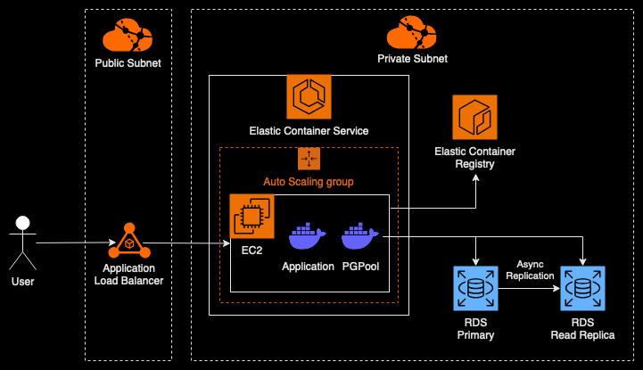

> A simple REST API service built with Golang and deployed to AWS ECS.

## Architecure

## Tech Stack

- [AWS ECS](https://aws.amazon.com/ecs/). Simple and reliable managed container service offered by AWS with fair pricing and robust integration to other ecosystems.
- [AWS RDS](https://aws.amazon.com/rds/). Reliable and feature-complete managed PostgreSQL database offered by AWS with various options for high-availability and horizontal scaling.
- [AWS ECR](https://aws.amazon.com/ecr/). Simple and reliable managed container registry offered by AWS which offers low latency and high throughput image pulls within AWS ecosystem.
- [AWS ALB](https://aws.amazon.com/elasticloadbalancing/application-load-balancer/). Fast and highly scalable managed L7 load balancer offered by AWS which offers various routing options, robust ecosystem integration, and SSL/TLS integration. This is perfect for REST applications.
- [Bitnami PGPool](https://bitnami.com/stack/pgpool). Simple PostgreSQL load balancer and connection pool management which offers load balancing between PostgreSQL primary and read-only replica for read queries. Bitnami offers simple configuration of pgpool via environment variables which is packaged using docker.
- [Chi](https://github.com/go-chi/chi). Simple and lightweight Go HTTP server with composable routing.
- [pgx](https://github.com/jackc/pgx). Widely used Go PostgreSQL driver with support for sqlc and connection pooling.
- [sqlc](https://github.com/sqlc-dev/sqlc). SQL code generator for generating type-safe code from SQL schema and queries to Go.
- [goose](https://github.com/pressly/goose). Database migration tool for creating, destroying, and checking SQL migrations.

## Database Replication

Replication is used to create read-only replica PostgreSQL instance for increasing read queries throuhgput. AWS RDS offers creating read-only replica instance using asynchronous streaming replication which is done by creating another RDS instance and referencing the primary DB in source database input. On self-hosted deployment, this is usually achieved by configuring replication related settings, such as archive_mode, wal_level, hot_standby, etc., and using pg_basebackup to stream the wal logs from primary to replica instance. PGPool is deployed alongside the app container and used for load balancing read queries.

## Network Design

There are 6 subnets which are devided based on internet connectivity (private and public) and availability zones (ap-southeast-1a, ap-southeast-1b, ap-southeast-1c). Most of the resources, which includes EC2, ECS and RDS, reside in a private subnet and spread accross availability zones if applicable. ALB reside in public subnet for it able to be reached publicly and forwards traffic to all availability zones. 

To facilitate connections to AWS API, VPC endpoints are created to required connections such as ECR, ECS, CloudWatch Logs, and Secrets Manager. 

## Security Groups

There are three security groups separating different use cases; main security group for EC2 and ECS which allows connection from RDS and ALB, RDS security group which only allows connection from main security group, and ALB security group which allow TCP port 80 and 443 from public. All security groups allow outbound connections by default.

